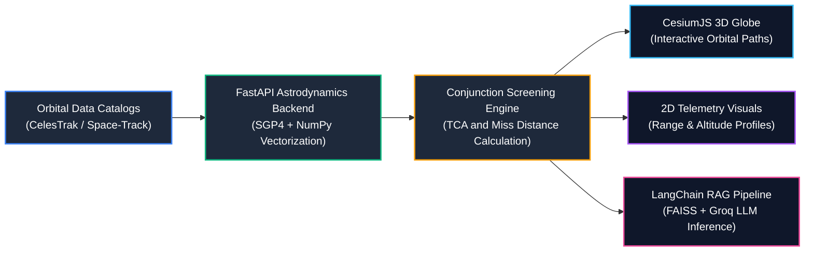
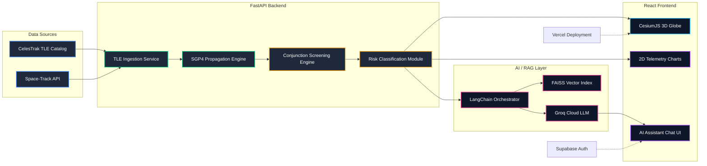
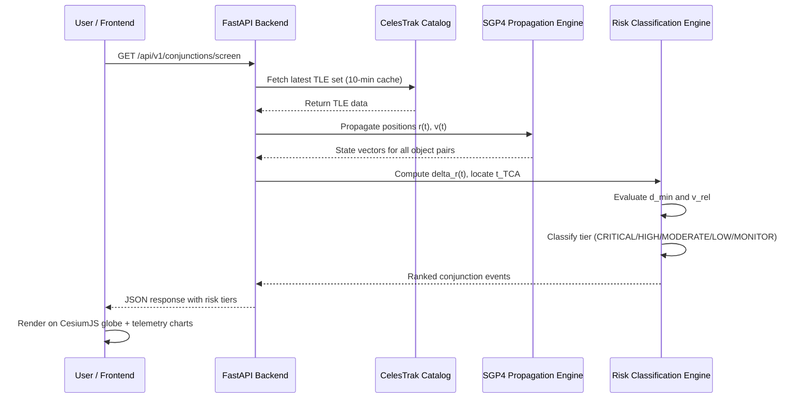
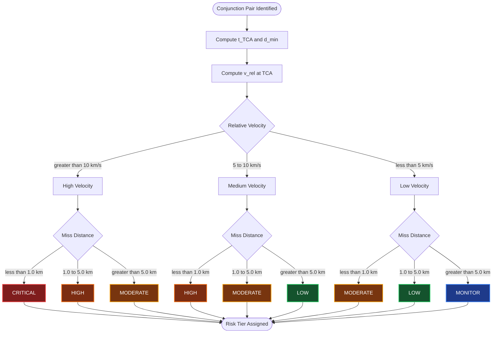
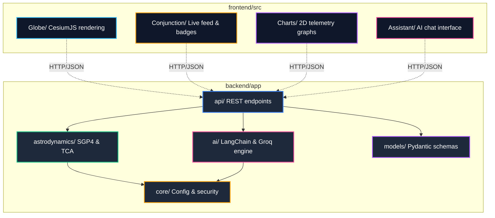
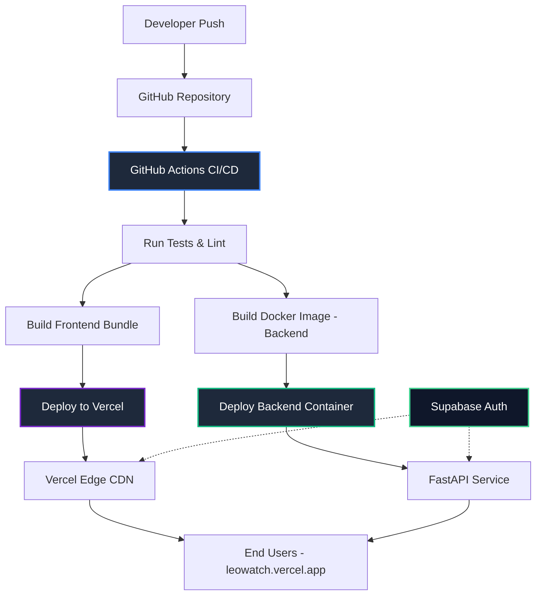

<div align="center">

# LEOWatch (OrbitWatch)
### Open-Source Space Debris Tracking and Conjunction Risk Console

*Developed by Team DeltaX*

[](https://leowatch.vercel.app/)
[](LICENSE)
[](https://cesium.com/)
[](https://groq.com/)

<br/>

**Low Earth Orbit is experiencing rapid congestion.** LEOWatch is a modern, open-access space situational awareness (SSA) console engineered to help CubeSat teams, academic institutions, and space startups monitor orbital debris, screen conjunction events, and interpret collision risks in plain language without relying on cost-prohibitive enterprise software.

[Launch Live Console](https://leowatch.vercel.app/) • [Project Background](#project-background) • [Quickstart](#local-development-setup) • [Architecture](#system-architecture-and-data-flow)

---

</div>

## Table of Contents
- [Project Background](#project-background)
- [Core Architectural Advantages](#core-architectural-advantages)
- [System Architecture and Data Flow](#system-architecture-and-data-flow)
- [Detailed System Architecture](#detailed-system-architecture)
- [Conjunction Screening Sequence](#conjunction-screening-sequence)
- [Astrodynamics and Risk Engine](#astrodynamics-and-risk-engine)
- [Covariance-Free Risk Classification Logic](#covariance-free-risk-classification-logic)
- [AI / RAG Explanation Pipeline](#ai--rag-explanation-pipeline)
- [Codebase Module Architecture](#codebase-module-architecture)
- [Deployment / CI-CD Pipeline](#deployment--ci-cd-pipeline)
- [Technology Stack](#technology-stack)
- [Engineering Challenges and Mitigations](#engineering-challenges-and-mitigations)
- [Environmental Impact and Orbital Sustainability](#environmental-impact-and-orbital-sustainability)
- [Repository Structure](#repository-structure)
- [Local Development Setup](#local-development-setup)
  - [Prerequisites](#prerequisites)
  - [Backend Setup (FastAPI)](#backend-setup-fastapi)
  - [Frontend Setup (React + Vite)](#frontend-setup-react--vite)
  - [Environment Variables](#environment-variables)
- [API Reference](#api-reference)
- [Scientific References](#scientific-references)
- [Team DeltaX](#team-deltax)

---

## Project Background

Low Earth Orbit (LEO) currently contains **over 27,500 tracked objects** alongside an estimated **1.2 million untracked debris fragments** larger than 1 cm, moving at hypervelocity speeds between 7 and 8 km/s.

At these velocities, even millimeter-scale debris carries sufficient kinetic energy to cause mission-terminating damage. Major satellite constellations execute hundreds of thousands of avoidance maneuvers annually. However, most available space surveillance and tracking platforms (such as AGI STK) are closed-source, cost-intensive, and require dedicated orbital flight dynamics teams.

```
       Current LEO Congestion Profile:
       +-------------------------+      +-------------------------+      +-------------------------+
       |   46,000+ Total Space   | ---> |    27,500+ Objects in   | ---> |   1.2 Million+ Debris   |
       |    Objects Catalogued   |      |     Low Earth Orbit     |      |    Particles (>1 cm)    |
       +-------------------------+      +-------------------------+      +-------------------------+
```

### The Institutional Barrier
University CubeSat programs, amateur research teams, and early-stage aerospace ventures frequently operate without dedicated flight dynamics personnel or multi-thousand-dollar software budgets. LEOWatch resolves this bottleneck by automating the entire pipeline from public Two-Line Element (TLE) ingestion to verified risk assessment in a single, accessible interface.

---

> **Economic and Safety Context:** Unaddressed space debris is projected to cost the commercial space sector between \$25.6 billion and \$42.3 billion over the next decade. Developing accessible, open screening tools is vital for sustainable access to space.

---

## Core Architectural Advantages

| Advantage | Implementation | Operational Value |
| :--- | :--- | :--- |
| **Unified SSA Pipeline** | Ingestion, SGP4 propagation, TCA computation, 3D visualization, and AI analysis combined in one application. | Eliminates tool-switching latency and manual data handoffs between disparate command-line tools and desktop apps. |
| **Single-Source-of-Truth** | Central FastAPI backend feeds the 3D globe, 2D telemetry charts, and LLM context simultaneously. | Guarantees numerical consistency across 3D rendering, conjunction tables, and AI explanations. |
| **Covariance-Free Risk Tiering** | Computes deterministic risk ratings using miss distance and relative encounter velocity at TCA. | Operates directly on publicly available TLE sets without requiring unavailable proprietary covariance matrices. |
| **Grounded AI Interpretation** | Retrieval-Augmented Generation (LangChain + FAISS + Groq Cloud) strictly conditioned on calculated backend data. | Delivers clear, plain-language risk breakdowns while preventing numerical hallucinations in safety-critical contexts. |
| **Interactive 3D / 2D Ephemeris** | WebGL-based CesiumJS digital globe with live orbit tracks and conjunction points. | Provides analysis-driven visualizations directly linked to real-time screening outputs rather than static displays. |

---

## System Architecture and Data Flow



---

## Detailed System Architecture



---

## Conjunction Screening Sequence



---

## Astrodynamics and Risk Engine

### 1. SGP4 Orbital Propagation
LEOWatch performs near-term propagation using the standard Simplified General Perturbations 4 (SGP4) analytical model:
$$\mathbf{r}(t), \mathbf{v}(t) = \text{SGP4}\big(\text{TLE}, t\big)$$
This model accounts for Earth gravitational field harmonics ($J_2, J_3, J_4$), atmospheric drag, and lunar/solar gravitational perturbations.

### 2. Time of Closest Approach (TCA)
For any pair of tracked objects $A$ and $B$, the relative position vector is:
$$\Delta \mathbf{r}(t) = \mathbf{r}_A(t) - \mathbf{r}_B(t)$$
The Time of Closest Approach ($t_{\text{TCA}}$) is identified when the separation magnitude reaches a global or local minimum:
$$t_{\text{TCA}} = \arg\min_t \|\Delta \mathbf{r}(t)\| \quad \text{where} \quad \frac{d}{dt}\|\Delta \mathbf{r}(t)\| = 0$$

### 3. Relative Encounter Velocity
The closing speed between the two objects at encounter dictates the kinetic severity:
$$v_{\text{rel}} = \|\mathbf{v}_A(t_{\text{TCA}}) - \mathbf{v}_B(t_{\text{TCA}})\|$$

### 4. Covariance-Free Conjunction Risk Matrix

| Relative Velocity \ Miss Distance | < 1.0 km | 1.0 - 5.0 km | > 5.0 km |
| :--- | :---: | :---: | :---: |
| **High Velocity (> 10 km/s)** | **CRITICAL** | **HIGH** | **MODERATE** |
| **Medium Velocity (5 - 10 km/s)** | **HIGH** | **MODERATE** | **LOW** |
| **Low Velocity (< 5 km/s)** | **MODERATE** | **LOW** | **MONITOR** |

---

## Covariance-Free Risk Classification Logic



---

## AI / RAG Explanation Pipeline

```mermaid
flowchart LR
    Q[User Query] --> Explain["POST /api/v1/ai/explain-risk or /ai/chat"]
    Explain --> Ground[Ground Query with Backend Risk Data]
    Ground --> Retrieve[LangChain Retriever]
    Retrieve --> FAISS[(FAISS Vector Index)]
    FAISS --> Context["Assembled Context: TCA, d_min, v_rel, Risk Tier"]
    Context --> Prompt[Construct Grounded Prompt]
    Prompt --> Groq[Groq Cloud LLM]
    Groq --> Validate[Post-process: Strip Unsupported Claims]
    Validate --> Response[Plain-Language Risk Narrative]
    Response --> UI[Assistant Chat UI]

    style FAISS fill:#0f172a,stroke:#ec4899,stroke-width:2px,color:#fff
    style Groq fill:#0f172a,stroke:#f05a28,stroke-width:2px,color:#fff
    style Ground fill:#1e293b,stroke:#10b981,stroke-width:2px,color:#fff
    style Validate fill:#1e293b,stroke:#f59e0b,stroke-width:2px,color:#fff
```



---

## Codebase Module Architecture



---

## Deployment / CI-CD Pipeline



---

## Technology Stack

- **Backend:** Python 3.11+, FastAPI, Uvicorn, NumPy, SciPy, `sgp4`
- **AI and RAG Layer:** LangChain, FAISS Vector Index, Groq Cloud API (Llama 3 / Mixtral)
- **Frontend:** React 18, Vite, JavaScript / TypeScript, Tailwind CSS, Framer Motion
- **Visualization:** CesiumJS (WebGL 3D Digital Globe), Recharts / Chart.js (2D Telemetry)
- **Authentication:** Supabase Auth
- **Infrastructure and Deployment:** Vercel (Client), Docker, GitHub Actions

---

## Engineering Challenges and Mitigations

| Technical Challenge | Root Cause | Implemented Mitigation |
| :--- | :--- | :--- |
| **SGP4 In-Track Error Growth** | Analytical SGP4 accuracy degrades (up to 25 km over multi-day spans). | Rolling short-window re-propagation paired with 10-minute automated TLE cache refreshes. |
| **Absence of TLE Covariance Data** | Public TLE format does not supply uncertainty matrices. | Implemented a deterministic two-axis risk model ($d_{\min}$ and $v_{\text{rel}}$) instead of estimating unverified probabilities. |
| **Active Maneuver Drift** | Satellites executing propulsion maneuvers drift from historical TLE records. | Shortened catalog polling intervals to reduce the window between physical maneuvers and refreshed element sets. |
| **LLM Hallucination Risk** | General-purpose language models may hallucinate technical parameters. | Generation is strictly constrained by a RAG layer grounded exclusively in verified backend calculation tables. |

---

## Environmental Impact and Orbital Sustainability

Uncontrolled accumulation of space debris poses a long-term threat to global satellite communications, Earth observation, and navigation systems. If orbital collision frequencies exceed natural atmospheric decay rates, a cascading chain reaction known as the **Kessler Syndrome** could render critical orbital bands unusable.

LEOWatch aligns with international space sustainability frameworks, including the **ESA Zero Debris Charter**:
- **Democratizing SSA Access:** Equips low-budget and educational satellite missions with reliable conjunction screening capabilities.
- **Preventative Collision Mitigation:** Identifies hazardous close encounters early, facilitating timely orbital avoidance maneuvers.
- **Open Standards:** Built on publicly accessible datasets and open-source tooling to foster collaboration across international space operators.

---

## Repository Structure

```
leowatch/
├── backend/
│   ├── app/
│   │   ├── api/             # REST endpoints (conjunctions, search, chat)
│   │   ├── astrodynamics/   # SGP4 propagation & TCA algorithms
│   │   ├── ai/              # LangChain RAG & Groq prompt engine
│   │   ├── core/            # Configuration & security settings
│   │   └── models/          # Pydantic data schemas
│   ├── requirements.txt
│   └── Dockerfile
│
├── frontend/
│   ├── src/
│   │   ├── components/
│   │   │   ├── Globe/       # CesiumJS 3D Earth & orbit rendering
│   │   │   ├── Conjunction/ # Live close-approach feed & risk badges
│   │   │   ├── Charts/      # 2D Miss distance & trajectory graphs
│   │   │   └── Assistant/   # AI chat interface & risk narratives
│   │   ├── App.jsx
│   │   └── index.css
│   ├── package.json
│   └── vite.config.js
│
├── docs/                    # Architecture diagrams & project documentation
└── README.md
```

---

## Local Development Setup

### Prerequisites
- Node.js (version 18 or higher)
- Python (version 3.11 or higher)
- Groq API Key (available from the [Groq Console](https://console.groq.com/))
- (Optional) Cesium Ion Access Token (available from [Cesium Ion](https://ion.cesium.com/))

---

### Backend Setup (FastAPI)

1. Navigate to the backend directory:
   ```bash
   cd backend
   ```

2. Create and activate a Python virtual environment:
   ```bash
   python -m venv venv
   
   # Windows:
   venv\Scripts\activate
   
   # macOS/Linux:
   source venv/bin/activate
   ```

3. Install required dependencies:
   ```bash
   pip install -r requirements.txt
   ```

4. Configure backend environment variables:
   ```bash
   cp .env.example .env
   ```

5. Launch the FastAPI application:
   ```bash
   uvicorn app.main:app --reload --port 8000
   ```
   *Swagger documentation is accessible at `http://localhost:8000/docs`.*

---

### Frontend Setup (React + Vite)

1. Navigate to the frontend directory:
   ```bash
   cd ../frontend
   ```

2. Install npm dependencies:
   ```bash
   npm install
   ```

3. Configure frontend environment variables:
   ```bash
   cp .env.example .env.local
   ```

4. Start the development server:
   ```bash
   npm run dev
   ```
   *The application will be accessible at `http://localhost:5173`.*

---

### Environment Variables

#### `backend/.env`
```env
PORT=8000
ENVIRONMENT=development
GROQ_API_KEY=gsk_your_groq_api_key_here
CELESTRAK_UPDATE_INTERVAL_MINUTES=10
ALLOWED_ORIGINS=http://localhost:5173,https://leowatch.vercel.app
```

#### `frontend/.env.local`
```env
VITE_API_URL=http://localhost:8000
VITE_CESIUM_ION_TOKEN=your_cesium_token_here
```

---

## API Reference

| HTTP Method | Path | Description |
| :--- | :--- | :--- |
| `GET` | `/api/v1/satellites/search?q={query}` | Search tracked catalog by NORAD ID or object name |
| `GET` | `/api/v1/satellites/{norad_id}/ephemeris` | Retrieve calculated trajectory coordinates over time |
| `GET` | `/api/v1/conjunctions/screen` | Retrieve screened conjunction events within a specified window |
| `GET` | `/api/v1/conjunctions/{event_id}` | Retrieve comprehensive telemetry and TCA parameters for an event |
| `POST` | `/api/v1/ai/explain-risk` | Generate a RAG-grounded plain-language risk assessment |
| `POST` | `/api/v1/ai/chat` | Context-aware conversational assistant for conjunction queries |

---

## Scientific References

1. CelesTrak NORAD Two-Line Element Sets: https://celestrak.org/NORAD/elements/
2. NASA Conjunction Assessment Risk Analysis (CARA) Best Practices Guide (OCE-51): https://nodis3.gsfc.nasa.gov/OCE_docs/OCE_51.pdf
3. NASA CARA Conjunction Event Prediction: https://www.nasa.gov/cara/step-1-conjunction-event-prediction/
4. ESA Space Debris Office (DISCOS): https://sdup.esoc.esa.int/discosweb/statistics/
5. USRA Orbital Debris Collision Modeling: https://www.hou.usra.edu/meetings/orbitaldebris2019/orbital2019paper/pdf/6157.pdf
6. ESA Zero Debris Charter: https://eu-space.europa.eu/programmes/space-safety-ssa-and-stm

---

## Team DeltaX

Developed and maintained by Team DeltaX.
- Live Deployment: [https://leowatch.vercel.app/](https://leowatch.vercel.app/)

---

<div align="center">
  <sub>Committed to space sustainability and open space situational awareness.</sub>
</div>
